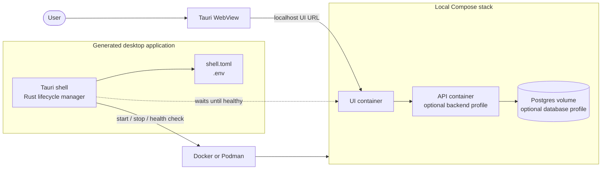

# compose-to-desktop-copier

Copier template for a desktop app that packages its application as container images. This repository is the generator; the copied project is the app.

The generated app is a Tauri 2 shell for macOS, Windows, and Linux. It starts a local Compose stack, waits for the UI health check, and opens the UI in the app window. The shell manages the stack lifecycle without depending on specific service names.

`make init` installs the Rust toolchain, Tauri CLI, and system WebView libraries. It uses Docker when available; otherwise it installs Podman and a Compose provider and records the choice in `.container-runtime`. `make dev` uses that choice through `CONTAINER_RUNTIME`. Windows release builds bundle Podman, and require WSL on first launch.

The sample answers describe `compose-to-desktop-copier`, with crate and Compose project `compose-to-desktop-copier`, bundle id `com.example.desktop`, serving `nginx:alpine` on port 3000. Accept them to render a known-good app, or replace them with the real product.

## Architecture

The desktop shell starts and monitors the local Compose stack, then displays its UI in the WebView.




## What it provides

Teams that already ship container images can use this template to add a desktop window, installer, and local startup path. Replace `docker-compose.yml` and `.env.example` with the product's stack. The generated shell handles the WebView lifecycle, health checks, secrets, and container runtime setup. `copier update` can bring template changes into generated apps.

Published ports bind to `127.0.0.1`; database ports stay off the host. Empty secret values are generated in `.env` on first launch, and named volumes survive `compose down`.

The same Compose stack used in the cloud can run on a developer or operator workstation. This is useful for development, testing, offline work, demos, training, and reproducing production issues without changing the images or service layout.

Typical uses:

- Local versions of cloud applications
- Offline or restricted-network deployments
- Customer demos and training environments
- Reproducing issues with the same images used in production
- Internal tools that need a self-contained desktop install

## Generate a project

Install [Copier](https://copier.readthedocs.io/) 9 and run:

```text
copier copy gh:dinhduy/compose-to-desktop-copier my-app
cd my-app
make init
make dev
```

Pin a release after this repository is tagged:

```text
copier copy gh:dinhduy/compose-to-desktop-copier --vcs-ref v1.0.0 my-app
```

Copier reads the latest tag when `--vcs-ref` is omitted. Use `--vcs-ref HEAD` to generate from the default branch. Copier copies tracked files, so commit the template before using it as a source. `scripts/test-template.sh` can copy the working tree, including uncommitted files.

Each stack contains `shell.toml`, `docker-compose.yml`, and `.env.example`. Optional `backend` and `database` profiles add an API and Postgres. Set `STACK_DIR` to run another stack during development. Debug builds use that directory or the project directory. Release builds ignore `STACK_DIR` and engine path overrides, and copy the root stack into app data so `.env` remains writable.

## Questions

| Answer | Sample default | Written into |
|---|---|---|
| `product_name` | `compose-to-desktop-copier` | Window title, installer name, NSIS text |
| `project_slug` | `compose-to-desktop-copier` | Cargo package, Compose project, Makefile |
| `bundle_identifier` | `com.example.desktop` | Tauri `identifier` |
| `description` | Thin desktop shell that starts a local Compose stack | `Cargo.toml` |
| `ui_port` | `3000` | `shell.toml`, `tauri.conf.json`, Compose |
| `include_backend` | `true` | optional `api` profile |
| `include_database` | `true` | optional Postgres profile and `POSTGRES_PASSWORD` |
| `license` | Proprietary, MIT, or Apache-2.0 | `LICENSE` |

`engine`, `wait_secs`, `allow_remote_ui`, and `remove_volumes` stay at the safe defaults in `shell.toml`. The dev engine is chosen by `make init` and stored in `.container-runtime` on that machine. It is gitignored and is a per-machine choice, so it is not a template answer.

`include_backend` and `include_database` apply on the first copy. Later edits to the stack belong in `docker-compose.yml` and `.env.example`.

Changing `bundle_identifier` after the first shipped installer publishes a different app.

## Update an existing app

Generated projects commit `.copier-answers.yml`. From the app directory:

```text
copier update
```

The update refreshes the Rust shell, init scripts, installer pins, and Makefile mechanics. It leaves these files alone when they already exist:

- `docker-compose.yml`
- `.env.example`
- `src-tauri/icons/`

If `copier update` reports a conflict in `shell.toml`, keep the local file when it holds secret keys you added after generation.

Patch releases are engine fixes. A minor release may add a question that has a default. A major release renames a question or changes the Compose contract, and ships a `_migrations` entry.

`copier update` needs a git tag on this template. Tag releases as `v1.0.0`, `v1.0.1`, and so on.

## Reference stack

`examples/superset/` is one full product stack, kept here to exercise the lint rules. It is not copied into generated apps. The generated shell lints `examples/` only when that directory exists.

## Check the template

`scripts/test-template.sh` renders the sample product and a frontend-only variant, runs `cargo test` and `make stack-check`, lints `examples/superset`, rejects an invalid slug, and checks that `copier update` keeps a modified Compose file while refreshing an engine script.

```text
bash scripts/test-template.sh
```

2026 Dinhduy | Grok 4.7 | GPT-5.6 Luna